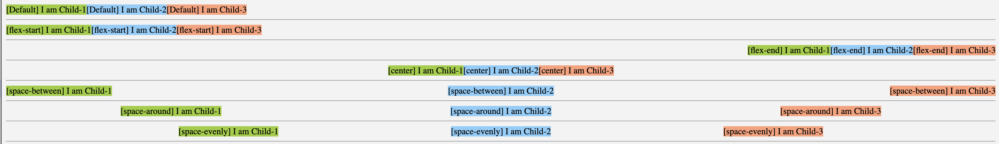
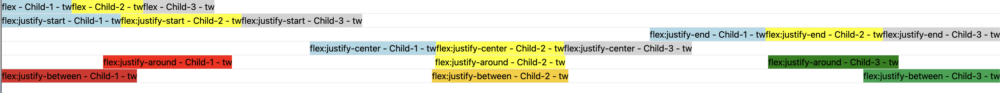
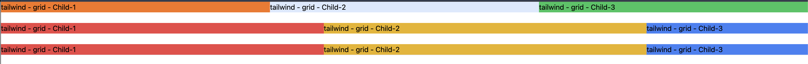
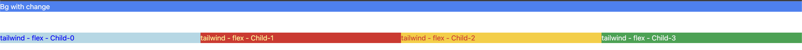

## Tailwind basics

- Flex in raw html | [Example](https://github.com/princebansal7/Web-Development-Concepts/blob/main/tailwind/01.flex-raw-html/01.flex.html) 
- **flex**: deals with spaces between the elements | [Example](https://github.com/princebansal7/Web-Development-Concepts/blob/main/tailwind/02.tailwind-react/src/components/Flex.jsx) 
- **grid**: deals with how many elements needs to be in single line based on the current width of the page | [Example](https://github.com/princebansal7/Web-Development-Concepts/blob/main/tailwind/02.tailwind-react/src/components/Grid.jsx) 
- both helps in responsiveness
- Responsiveness | [Example](https://github.com/princebansal7/Web-Development-Concepts/blob/main/tailwind/02.tailwind-react/src/components/ResponsivenessWithBreakPoints.jsx) 
  - Tailwind has breakpoints which basically defines the general sizes after which layout changes | [Read](https://tailwindcss.com/docs/responsive-design#using-custom-breakpoints) 
  - Tailwind: to target breakpoint this is important | [Read](https://tailwindcss.com/docs/responsive-design#working-mobile-first)  
  - Tailwind is by-default mobile first => whatever you write without breakpoints is default true for mobile anything after that use breakpoints
  - this means class takes affect when layout reaches greater than or equal to break-point.
  - Project [Link](https://github.com/princebansal7/Web-Development-Concepts/tree/main/projects/04-react-tailwind-bgchange#readme)
- How to install tailwind in vite react [refer-link](https://tailwindcss.com/docs/guides/vite)